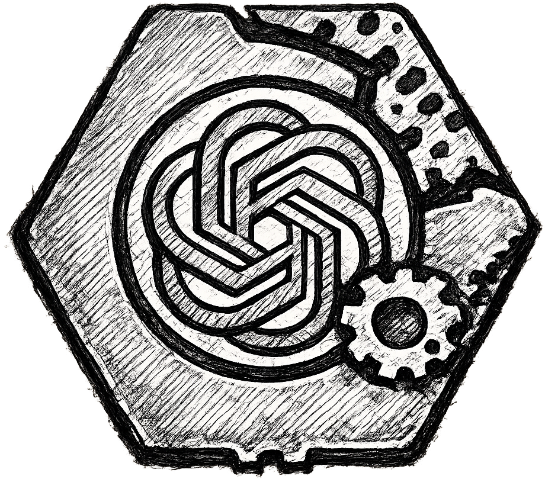

# ChatGPT Desktop

A native Windows desktop application for [ChatGPT](https://chatgpt.com/), built with [Tauri 2](https://v2.tauri.app/). Runs as a standalone WebView2 window with system tray integration.



## Features

- **Native window** — dedicated Chrome-based WebView2 for ChatGPT, not a browser tab
- **System tray** — minimize to tray, left-click to restore, right-click for menu
- **Minimize-on-close** — closing hides to tray instead of quitting
- **Launch at startup** — optional toggle in tray menu
- **Single instance** — prevents duplicate windows
- **Login in-app** — Google, Apple, and Microsoft SSO are handled directly inside the native window (no external browser redirect)
- **No telemetry** — no tracking, no analytics, no bloat

## Downloads

Pre-built binaries are available on the [Releases](https://github.com/nwn900/ChatGPTDesktopApp/releases) page:

| Package | File |
|---|---|
| Installer (NSIS) | `ChatGPT_1.0.0_x64-setup.exe` |
| Portable EXE | `chatgpt-desktop-app.exe` |

## Prerequisites (Building from Source)

- [Rust](https://rustup.rs/) (latest stable)
- [Node.js](https://nodejs.org/) (v18+)
- [WebView2](https://developer.microsoft.com/en-us/microsoft-edge/webview2/) — pre-installed on Windows 10 and later

## Build from Source

```sh
git clone https://github.com/nwn900/ChatGPTDesktopApp.git
cd ChatGPTDesktopApp/src-tauri
cargo tauri build
```

Output goes to `src-tauri/target/release/`.

## Usage

- **Left-click** tray icon → show/focus window
- **Right-click** tray icon → menu: Open, Login, autostart toggle, Close
- **Login...** → navigates the native window to `chatgpt.com` for in-app authentication
- **Close** → quits the application entirely

## License

ISC
